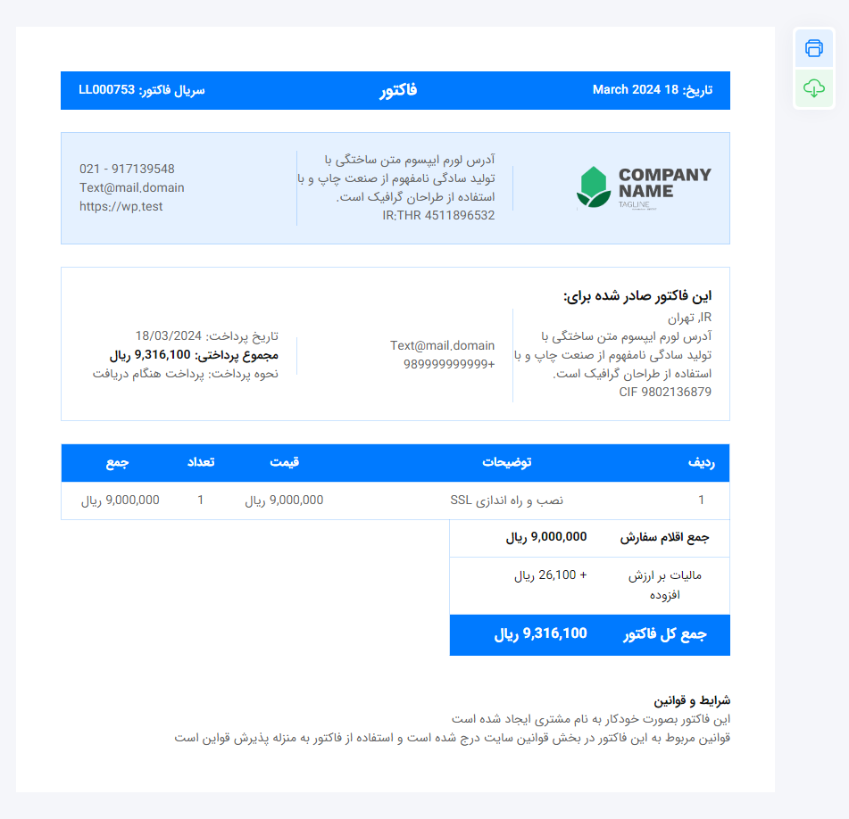

<!-- Switch Option -->

Switch Language / تغییر زبان

[English](#english) | [فارسی](#فارسی)

---

# Installation Instructions / راهنمای نصب:

English

1. First, create a page in WordPress with any desired name, preferably "invoice".
2. Create a file named `page-invoice.php` in the root directory of your WordPress theme.
3. Then, navigate to the page you created and select the "Invoice Template" theme.
4. That's it!

Now, your customers can access their respective invoices using the following link:
- Sample.domain/invoice?id=order_id

فارسی

1. ابتدا یک صفحه در وردپرس با هر نام دلخواهی، ترجیحاً "فاکتور"، ایجاد کنید.
2. یک فایل با نام `page-invoice.php` در دایرکتوری اصلی قالب وردپرس خود ایجاد کنید.
3. سپس وارد صفحه‌ای که ساختید شده و قالب "Invoice Template" را انتخاب کنید.
4. تمام!

حالا مشتریان شما می‌توانند با استفاده از لینک زیر به فاکتور متعلق به خودشان دسترسی داشته باشند:
- Sample.domain/invoice?id=order_id

---

## Note / توجه:

English

- For privacy protection, if the invoice doesn't exist, users will encounter a 404 error.
- If the requested invoice doesn't belong to the current user, a 403 error will be encountered.

فارسی

- برای حفظ حریم خصوصی، در صورت عدم وجود فاکتور، کاربران با یک خطای 404 مواجه خواهند شد.
- اگر فاکتور درخواستی به کاربر فعلی تعلق نداشته باشد، با یک خطای 403 مواجه خواهند شد.

